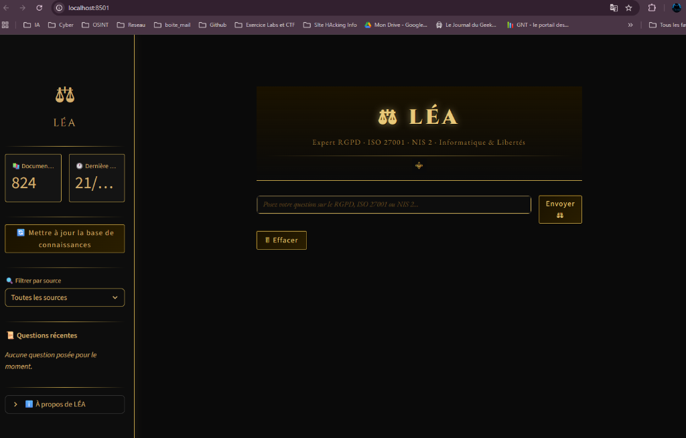
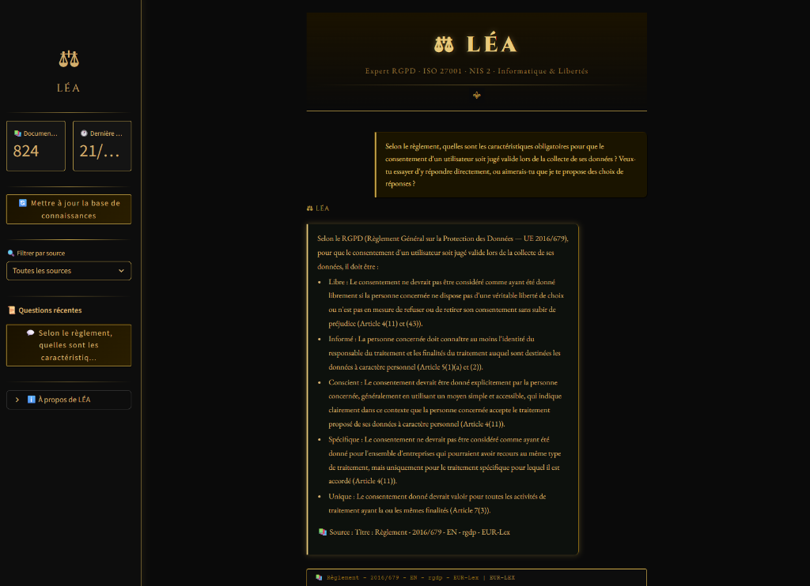
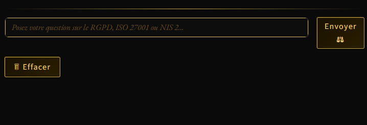

# ⚖ LÉA — Liberté, Expertise, Assistance

> **Agent IA conversationnel expert en droit numérique européen**
> RGPD · ISO 27001 · NIS 2 · Informatique & Libertés

---

## 🖼 Aperçu

<p align="center">
  
</p>

<p align="center">
  
</p>

<p align="center">
  
</p>

---

## 🧠 Qu'est-ce que LÉA ?

LÉA (Liberté, Expertise, Assistance) est une solution d'intelligence artificielle conversationnelle entièrement locale, conçue pour accompagner les professionnels de la cybersécurité, les DPO, les juristes, les consultants en conformité et toute personne souhaitant comprendre et appliquer le cadre réglementaire européen en matière de protection des données et de sécurité informatique. Contrairement aux chatbots généralistes qui reposent sur des API cloud et dont les réponses sont souvent approximatives ou inventées, LÉA fonctionne **à 100% en local sur votre machine** — aucune donnée, aucune question, aucun document ne quitte jamais votre poste de travail. C'est une garantie fondamentale pour des professionnels manipulant quotidiennement des informations sensibles.

LÉA s'appuie sur une architecture **RAG (Retrieval-Augmented Generation)** qui lui permet de ne jamais inventer de réponse. Concrètement, la solution commence par **scraper automatiquement les sources officielles** — les sites de la CNIL, de l'ANSSI (cyber.gouv.fr) et d'EUR-Lex — pour en extraire les textes de loi, les guides pratiques et les fiches réglementaires dans leur version la plus récente. Ces documents sont ensuite **découpés en fragments sémantiques**, transformés en **vecteurs d'embeddings** via le modèle `nomic-embed-text` d'Ollama, puis stockés dans une **base vectorielle ChromaDB** persistante. Lorsque vous posez une question, LÉA recherche les passages les plus pertinents dans sa base de connaissances, les injecte dans le contexte du modèle de langage `Mistral` (lui aussi exécuté en local via Ollama), et génère une réponse argumentée en **citant systématiquement ses sources** avec les titres et liens vers les textes d'origine.

Le tout est présenté dans une **interface Streamlit au design Art Déco** soigné, avec un thème sombre et doré, pensée pour une utilisation professionnelle quotidienne. L'interface inclut un **système d'apprentissage adaptatif** : vous pouvez noter chaque réponse avec 👍 ou 👎, et en cas de réponse insatisfaisante, proposer une correction qui sera mémorisée et réutilisée en priorité lors de questions similaires futures. LÉA s'améliore ainsi de session en session grâce à vos retours. Enfin, un **système d'indexation incrémentale** permet de mettre à jour la base de connaissances en un clic, sans tout réindexer depuis zéro.

**En résumé, LÉA est votre assistante juridique IA privée, qui ne fabule pas, qui cite ses sources, qui apprend de vos retours, et qui respecte votre confidentialité à 100%.**

---

## ✨ Points forts

| | Fonctionnalité | Description |
|:---:|----------------|-------------|
| 🔒 | **100% local** | Aucune donnée ne quitte votre machine — Ollama tourne en local |
| � | **Sources vérifiables** | Chaque réponse cite ses textes officiels d'origine |
| 🧠 | **Apprentissage adaptatif** | Vos retours (👍/👎) améliorent les réponses de session en session |
| � | **Mise à jour en 1 clic** | Scraping + indexation incrémentale via l'interface |
| 🎨 | **Interface Art Déco** | Design professionnel sombre et doré, pensé pour un usage quotidien |
| ⚡ | **RAG performant** | 824 chunks indexés, recherche vectorielle sub-seconde |

---

## 📚 Sources de connaissance intégrées

| Source | Domaine | Contenu |
|--------|---------|---------|
| 🏛 **CNIL** | cnil.fr | RGPD, Informatique & Libertés, droits des personnes, obligations des professionnels |
| 🛡 **ANSSI** | cyber.gouv.fr | Directive NIS 2, réglementation cybersécurité, guides de bonnes pratiques |
| 🇪🇺 **EUR-Lex** | eur-lex.europa.eu | Textes juridiques UE : Règlement 2016/679 (RGPD), Directive 2022/2555 (NIS 2) |
| 📋 **ISO 27001** | Sources libres | Norme ISO/CEI 27001 — Systèmes de Management de la Sécurité de l'Information |

---

## 🏗 Architecture technique

```
   📡 Scraping officiel         🧠 Indexation RAG            💬 Chat intelligent
   ┌──────────────────┐     ┌─────────────────────┐     ┌─────────────────────┐
   │  CNIL · ANSSI    │ ──▶ │  Cleaning + Chunking│ ──▶ │  Streamlit Art Déco │
   │  EUR-Lex         │     │  Embeddings (Ollama) │     │  Mistral via Ollama │
   │  Selenium/HTTP   │     │  ChromaDB vectoriel  │     │  Sources + confiance│
   └──────────────────┘     └─────────────────────┘     └─────────────────────┘
        scraper.py               indexer.py              agent.py + app.py
```

---

## ⚙️ Prérequis système

- **Python 3.10** ou supérieur
- **Google Chrome** (pour le scraping Selenium en fallback)
- **Ollama** — moteur LLM 100% local ([ollama.ai](https://ollama.ai))

### Installation des modèles Ollama

```bash
ollama pull mistral
ollama pull nomic-embed-text
```

Vérification :
```bash
ollama list
# Vous devez voir : mistral et nomic-embed-text
```

---

## 🚀 Installation pas-à-pas

### 1. Cloner le projet

```bash
git clone https://github.com/Dow08/Agent_RGPD.git
cd Agent_RGPD
```

### 2. Créer et activer l'environnement virtuel

```bash
python -m venv venv

# Windows :
venv\Scripts\activate

# Mac / Linux :
source venv/bin/activate
```

### 3. Installer les dépendances

```bash
pip install -r requirements.txt
```

### 4. Configurer l'environnement

```bash
copy .env.example .env        # Windows
cp .env.example .env          # Linux/Mac
```

### 5. Lancer la solution

```bash
# 1. S'assurer qu'Ollama tourne
ollama serve

# 2. Scraper les sources officielles
python scraper.py

# 3. Indexer les documents
python indexer.py

# 4. Lancer LÉA
streamlit run app.py
```

Ouvrez votre navigateur sur **http://localhost:8501** 🎉

---

## ✅ Checklist de démarrage rapide

- [ ] Ollama installé + `mistral` et `nomic-embed-text` téléchargés
- [ ] `.env.example` copié → `.env`
- [ ] Scraping exécuté : `python scraper.py`
- [ ] Indexation exécutée : `python indexer.py`
- [ ] LÉA lancée : `streamlit run app.py`
- [ ] Interface ouverte : **http://localhost:8501**

---

## 💬 Utilisation

### Poser une question
Tapez votre question dans la zone de saisie en bas de page et cliquez sur **Envoyer ⚖**.

### Lire la réponse
LÉA affiche sa réponse avec :
- 📚 **Les sources citées** — titres et liens vers les textes officiels d'origine
- 📊 **Le score de confiance** — barre de progression (0-100%)
- 🧠 **Indicateur de correction** — si la réponse a été enrichie par un retour précédent

### Interpréter le score de confiance

| Score | Signification |
|-------|---------------|
| 80-100% | Réponse très fiable, sources multiples concordantes |
| 60-79% | Réponse probable, vérification recommandée |
| < 60% | Réponse incertaine, consulter les sources originales |

### Améliorer LÉA avec vos retours
- **👍** — Valide la réponse et la mémorise comme fiable
- **👎** — Ouvre un champ de correction, réutilisé prioritairement pour les questions similaires futures

### Filtrer par source
Sélecteur dans la barre latérale : Toutes les sources · CNIL · NIS 2 · ISO 27001 · EUR-Lex

---

## ❓ Exemples de questions

```
RGPD :
  → Quels sont les droits d'un individu sur ses données personnelles ?
  → Quand est-il obligatoire de nommer un DPO ?
  → Qu'est-ce qu'une violation de données et comment la déclarer à la CNIL ?

NIS 2 :
  → Quelles entreprises sont concernées par la directive NIS 2 ?
  → Quelles sanctions en cas de non-conformité NIS 2 ?

ISO 27001 :
  → Qu'est-ce qu'un SMSI selon ISO 27001 ?
  → Quelle est la différence entre ISO 27001 et RGPD ?
```

---

## 🔄 Mise à jour de la base de connaissances

### Via l'interface
Cliquez sur **🔄 Mettre à jour la base de connaissances** dans la barre latérale.

### Automatisation (Windows — Planificateur de tâches)

1. Ouvrez `taskschd.msc`
2. Créez une tâche de base mensuelle (1er du mois, 03h00)
3. Programme : `C:\chemin\venv\Scripts\python.exe`
4. Arguments : `scraper.py` puis `indexer.py`
5. Démarrer dans : `C:\chemin\Agent_RGPD\`

### Automatisation (Linux/Mac — Cron)

```bash
0 3 1 * * /chemin/venv/bin/python /chemin/Agent_RGPD/scraper.py >> /chemin/data/logs/cron.log 2>&1
0 4 1 * * /chemin/venv/bin/python /chemin/Agent_RGPD/indexer.py >> /chemin/data/logs/cron.log 2>&1
```

---

## 🧠 RAG adaptatif — Comment ça marche ?

```
1. Vous posez une question
2. LÉA cherche les passages pertinents dans ChromaDB (recherche vectorielle)
3. Les passages + votre question sont envoyés à Mistral (local)
4. Mistral génère une réponse sourcée

   👍 → Réponse sauvegardée comme "validée" (score boosté)
   👎 → Vous saisissez la correction → sauvegardée dans corrections.json
       → Réutilisée en priorité pour les questions similaires futures

5. corrections.json rechargé à chaque démarrage → amélioration continue
```

**Fichiers d'apprentissage :**
- `corrections.json` — mémoire d'apprentissage (corrections + embeddings)
- `feedback.json` — historique brut de tous les retours

---

## 📁 Structure du projet

```
Agent_RGPD/
├── config.py               # Configuration centralisée (.env)
├── scraper.py              # Moteur de scraping multi-sources (CNIL, ANSSI, EUR-Lex)
├── indexer.py              # Chunking + embeddings Ollama + ChromaDB
├── agent.py                # Cerveau RAG + apprentissage adaptatif
├── app.py                  # Interface Streamlit Art Déco
├── parsing_patterns.json   # Patterns CSS validés (auto-généré)
├── requirements.txt        # Dépendances Python
├── .env.example            # Template de configuration
├── .env                    # Configuration locale (non versionné)
├── .gitignore              # Exclusions Git
├── corrections.json        # Mémoire d'apprentissage (auto-généré)
├── feedback.json           # Feedback brut (auto-généré)
├── README.md               # Ce fichier
├── docs/                   # Screenshots et documentation
│   ├── lea_accueil.png
│   ├── lea_reponse.png
│   └── lea_input.png
└── data/
    ├── raw/                # Fichiers .md bruts issus du scraping
    ├── vectorstore/        # Base ChromaDB persistante
    └── logs/               # Logs d'exécution horodatés
```

---

## 👤 À propos

Projet développé par **Seallia**.

🔗 **Portfolio TryHackMe** : [tryhackme.com/p/seallia81](https://tryhackme.com/p/seallia81)

---

<p align="center">
  <strong>⚖ LÉA — Votre assistante juridique IA, locale et confidentielle.</strong>
</p>
